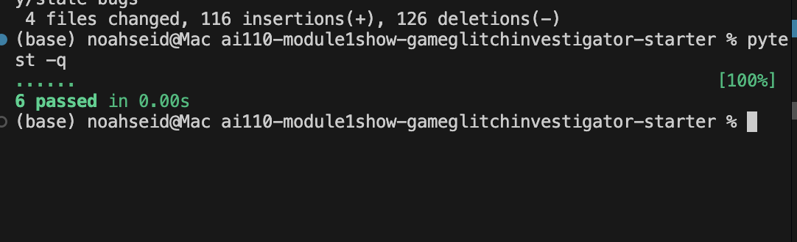

# 🎮 Game Glitch Investigator: The Impossible Guesser

## 🚨 The Situation

You asked an AI to build a simple "Number Guessing Game" using Streamlit.
It wrote the code, ran away, and now the game is unplayable. 

- You can't win.
- The hints lie to you.
- The secret number seems to have commitment issues.

## 🛠️ Setup

1. Install dependencies: `pip install -r requirements.txt`
2. Run the broken app: `python -m streamlit run app.py`

## 🕵️‍♂️ Your Mission

1. **Play the game.** Open the "Developer Debug Info" tab in the app to see the secret number. Try to win.
2. **Find the State Bug.** Why does the secret number change every time you click "Submit"? Ask ChatGPT: *"How do I keep a variable from resetting in Streamlit when I click a button?"*
3. **Fix the Logic.** The hints ("Higher/Lower") are wrong. Fix them.
4. **Refactor & Test.** - Move the logic into `logic_utils.py`.
   - Run `pytest` in your terminal.
   - Keep fixing until all tests pass!

## 📝 Document Your Experience

- [x] Describe the game's purpose.  
  The app is a Streamlit number-guessing game where the player tries to find a secret number within a limited number of attempts based on difficulty.
- [x] Detail which bugs you found.  
  The original version had reversed hint directions, inconsistent range/attempt display, incomplete New Game state reset, and unstable comparisons caused by mixed secret types.
- [x] Explain what fixes you applied.  
  Core logic was refactored into `logic_utils.py`, hint logic was corrected, attempts/range/state handling was repaired in `app.py`, and regression tests were added in `tests/test_game_logic.py`.

## 📸 Demo

- [x] Fixed game demo complete.
- Verified manually in Streamlit that the game can be won, hints now guide correctly, and New Game starts a clean session in the selected difficulty range.
- Verified with `pytest` that all tests pass (`6 passed`), including a regression test for the reversed-hint bug.

## 🚀 Stretch Features

- [ ] [If you choose to complete Challenge 4, insert a screenshot of your Enhanced Game UI here]
